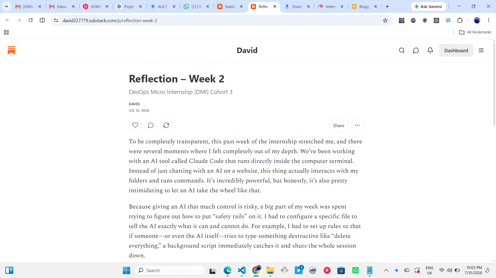

# Assignment 8 — Week 2 Reflection Blog

Part of the DevOps Micro Internship (DMI) Cohort 3 with Agentic AI

---

# Purpose

In this assignment, you will reflect on your Week 2 learning journey and write a short blog capturing your experience working with Agentic AI tools such as Claude Code, Skills, Subagents, MCP, Hooks, Permissions, and Memory.

You will also publish a LinkedIn post summarizing your learning and share both links for evaluation.

---

# Task 1 — Write Your Reflection Blog

## Goal

Write a reflection blog covering your Week 2 learning experience.

### Blog Requirements

Your blog must include:

- Title: **Reflection – Week 2**
- Minimum 300 words
- At least 2–3 topics from Week 2 (Claude Code, Skills, Subagents, MCP, Hooks, Permissions, Memory)
- Honest personal reflection (learning, challenges, mindset)
- One habit/system you plan to implement
- Your full name clearly visible

### Allowed Platforms

You can publish your blog on:

- Hashnode
- Medium
- Dev.to
- LinkedIn Article
- GitHub Markdown file
- Substack

---

### Evidence

#### Screenshot 1 — Blog published and visible

Add your screenshot here.


---

### Submission Field

Blog Link:

`https://open.substack.com/pub/david227779/p/reflection-week-2?r=8qepx8&utm_campaign=post-expanded-share&utm_medium=web_________________________________________`

---

# Task 2 — Create LinkedIn Post

## Goal

Share your Week 2 learning publicly on LinkedIn.

---

### LinkedIn Post Requirements

Your post must include:

- One screenshot from any Week 2 assignment
- Short reflection (what you learned or built)
- Required P.S. line exactly as given below

---

### Required P.S. Line (Must Include Exactly)

P.S. This post is a part of DevOps Micro Internship with Agentic AI Cohort-3 by Pravin Mishra. You can start your DevOps journey by joining this Discord community ( [https://discord.pravinmishra.com/](https://discord.pravinmishra.com/) ).

---

### Suggested Hashtags

#DMIByPravinMishra #AgenticAI #ClaudeCode #DevOps #LearningInPublic

---

### Evidence

#### Screenshot 2 — LinkedIn post published

Add your screenshot here.


---

### Submission Field

LinkedIn Post Content (copy-paste here):

```
Paste your LinkedIn post content here
```

Week 2 Self Reflection at DMI

To be completely honest, Week 2 of the DevOps Micro Internship (DMI) with Agentic AI has been a real test of patience. 😅

We've been working directly inside the command line terminal with an AI tool called Claude Code. Letting an AI tool actually navigate my folders and run commands is pretty intimidating, and I’ll admit I felt out of my depth more than a few times this week.

Instead of just sailing through, I spent hours hitting walls, staring at broken bracket errors, and dealing with system crashes. But here is what I actually managed to figure out through all the trial and error:

1. Setting up Safeguards: I learned how to build "safety rails" in the configuration files. Now, if a destructive command (like accidentally deleting a database or wiping files) gets typed, a background script immediately intercepts it and shuts the tool down.

2. Project Memory: I set up a memory file so the AI actually remembers our specific project rules—even after I completely close out the terminal or restart my computer.

I am definitely not an expert at this yet, and navigating these terminal tools still feels pretty messy. But despite the frustration and the steep learning curve, I'm proud that I kept pushing and didn't throw in the towel when the code kept breaking.

On to the next week! Big thanks to Pravin Mishra for keeping us on our toes and our very talent co-mentors for steering us the right way Anjana Muthunayake Faith Samson Joy Ukpabi Rukevwe ubioworo

#DMIByPravinMishra #AgenticAI #ClaudeCode #DevOps #LearningInPublic

---

## P.S. This post is a part of DevOps Micro Internship with Agentic AI Cohort-3 by Pravin Mishra. You can start your DevOps journey by joining this Discord community ( https://lnkd.in/exuGgzPf ).

### LinkedIn Post Link:

`https://www.linkedin.com/posts/david-agada-adikwu-366204413_join-the-dmi-devops-micro-internship-activity-7481458388896473088-vOQE?utm_source=share&utm_medium=member_desktop&rcm=ACoAAGk3JP4BsLau0-QyQ8vQJtHYuSnqctmRxH0___________________________________`

---

# Submission Instructions

- Blog must be publicly accessible
- LinkedIn post must be visible (public or unlisted where applicable)
- All required fields must be filled
- Screenshot proofs must be added to GitHub repository
- Do not include sensitive information in blog or post

---

# Completion Checklist

- [ ] Blog written with required structure
- [ ] Blog includes at least 2–3 Week 2 topics
- [ ] Blog is publicly accessible
- [ ] LinkedIn post created
- [ ] Required P.S. line included
- [ ] LinkedIn post content copied in submission field
- [ ] Blog link added
- [ ] LinkedIn post link added
- [ ] Screenshots added to GitHub repo

---

# About DMI & CloudAdvisory

DevOps Micro Internship (DMI) is a project-based DevOps program run by Pravin Mishra (The CloudAdvisory), focused on real-world execution, systems thinking, and agentic AI workflows.

It helps learners build strong DevOps foundations through hands-on experience.

---

# Resources

- 🌐 DMI Official Website: [https://pravinmishra.com/dmi](https://pravinmishra.com/dmi)
- 🎓 DevOps for Beginners (Udemy): [https://www.udemy.com/course/devops-for-beginners-docker-k8s-cloud-cicd-4-projects/](https://www.udemy.com/course/devops-for-beginners-docker-k8s-cloud-cicd-4-projects/)
- 🎓 Agentic AI DevOps with Claude Code: [https://www.udemy.com/course/ultimate-agentic-ai-devops-with-claude-code/](https://www.udemy.com/course/ultimate-agentic-ai-devops-with-claude-code/)
- 🎓 DevOps with Claude Code: Terraform, EKS, ArgoCD & Helm: [https://www.udemy.com/course/devops-with-claude-code-terraform-eks-argocd-helm/](https://www.udemy.com/course/devops-with-claude-code-terraform-eks-argocd-helm/)
- ▶️ YouTube Playlist: [https://www.youtube.com/playlist?list=PLFeSNDtI4Cho](https://www.youtube.com/playlist?list=PLFeSNDtI4Cho)
- 🔗 Pravin Mishra (LinkedIn): [https://www.linkedin.com/in/pravin-mishra-aws-trainer/](https://www.linkedin.com/in/pravin-mishra-aws-trainer/)
- 🏢 CloudAdvisory (LinkedIn): [https://www.linkedin.com/company/thecloudadvisory/](https://www.linkedin.com/company/thecloudadvisory/)
